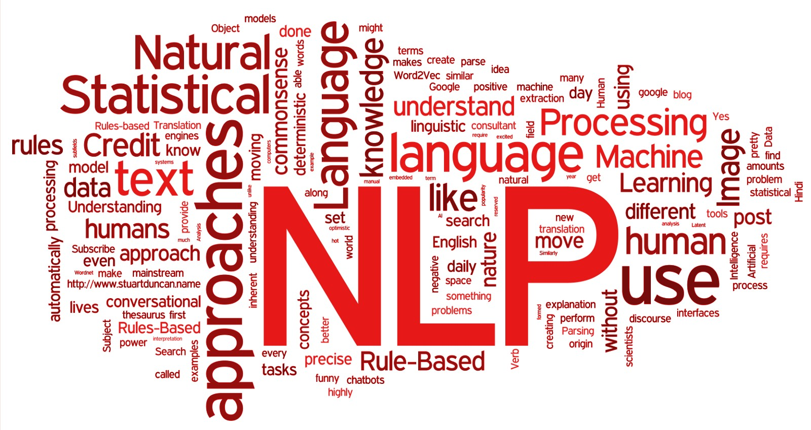

# Natural-Language-Processing(NLP)
____________________________________
This repository contains material about NLP from scratch to advanced. It consists of notebooks as well as python file for various deep learning topics. In most cases, the notebooks lead you through implementing models such as Sentiment Analysis, Recommemdation system, Text Correction and Bot etc.
_________________

   
  <i>copyright: ref(4) </i>

Natural language processing (NLP) is a subfield of linguistics, computer science, and artificial intelligence concerned with the interactions between computers and human language, in particular how to program computers to process and analyze large amounts of natural language data. The result is a computer capable of "understanding" the contents of documents, including the contextual nuances of the language within them. The technology can then accurately extract information and insights contained in the documents as well as categorize and organize the documents themselves.

   
  <i>copyright: ref(5) </i>

Natural Language Processing (NLP) uses algorithms to understand and manipulate human language. This technology is one of the most broadly applied areas of machine learning. As AI continues to expand, so will the demand for professionals skilled at building models that analyze speech and language, uncover contextual patterns, and produce insights from text and audio.
_______________
## Author
+ Name: Md Jahid Hasan
+ 𝐏𝐡𝐨𝐧𝐞: (+880) 1772905097 (Whatsapp)
+ 𝘔𝘢𝘪𝘭: jahidnoyon36@gmail.com
+ LinkedIn: http://linkedin.com/in/hellojahid

____________________

------------
#### Reference
+ https://www.fleetscience.org/science-blog/tech-it-out-natural-language-processing
+ https://en.wikipedia.org/wiki/Natural_language_processing
+ https://www.deeplearning.ai/program/natural-language-processing-specialization/
+ https://www.linkedin.com/company/natural-language-processing-montreal/
+ https://www.fleetscience.org/science-blog/tech-it-out-natural-language-processing